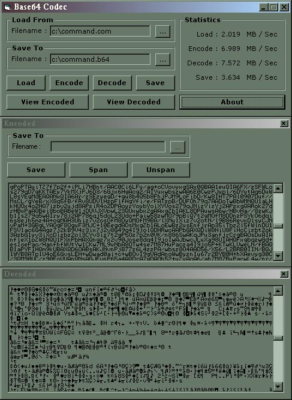



## Base64 Codec

### Description

<small>

The original source code was from someone (AndrComm or Sebastien?) else. I recode the whole thing, but having reference to the original. Anyway thanks, whoever who are who wrote the original code (yeahh.. all creadits to him) since i learnt some performance optimization (my original codes are tremendously slow).I did some code clean up and comments. The encode speed increased by 20%, decoded speed increased by 30%. Here's the best results that i come out with:

  

   file : command.com (93,040 bytes)

  load : 2.56 mb/sec (n/a in original code)

  save : 3.39 mb/sec (n/a in original code)

 encode : 7.17 mb/sec (20% faster, original code runs at 6.05 mb/sec)

 decode : 7.31 mb/sec (30% faster, original code runs at 5.61 mb/sec)

 

 Here's the changes I've made :

 

 1. *REWROTE* code clean up (i think it should be more readable)

 2. *REWROTE* encode and decode table is created together.

 3. *REWROTE* sub DECODE rewrote (should be faster).

 4. *REWROTE* sub SPAN and UNSPAN now supports SpanSeparator.

 5. *ADDED*  More detailed co1mments for novice, not experts

 6. *ADDED*  some form controls, for input and output.

 7. *ADDED*  file loading and saving feature

 8. *FIXED*  encode / decode rate calculation fixed... more accurate

        should be 1 sec = 1024 ticks (kernel 1044 ticks?)

        and 1 mb = 1048576 bytes. (1024b x 1024b)

  

 and some other minor corrections as well...

</small>
 
### More Info
 

             |
---                |---
**Submitted On**   |2000-09-09 14:22:32
**By**             |[Chin Huat](https://github.com/Planet-Source-Code/PSCIndex/blob/master/ByAuthor/chin-huat.md)
**Level**          |Advanced
**User Rating**    |4.7 (66 globes from 14 users)
**Compatibility**  |VB 5\.0, VB 6\.0
**Category**       |[String Manipulation](https://github.com/Planet-Source-Code/PSCIndex/blob/master/ByCategory/string-manipulation__1-5.md)
**World**          |[Visual Basic](https://github.com/Planet-Source-Code/PSCIndex/blob/master/ByWorld/visual-basic.md)
**Archive File**   |[CODE\_UPLOAD9742982000\.zip](https://github.com/Planet-Source-Code/chin-huat-base64-codec__1-11351/archive/master.zip)

